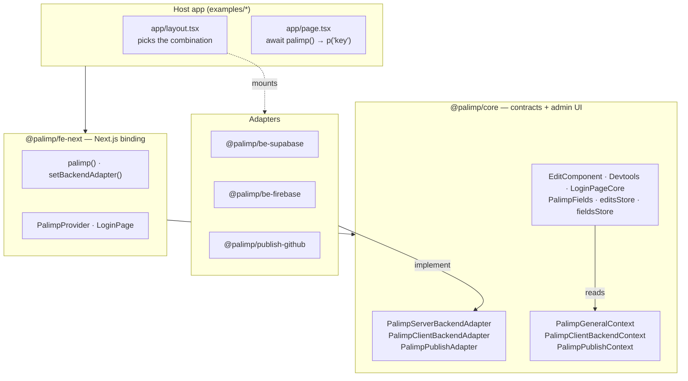
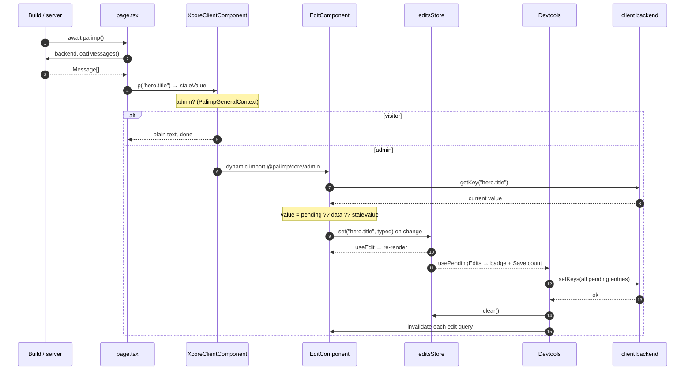
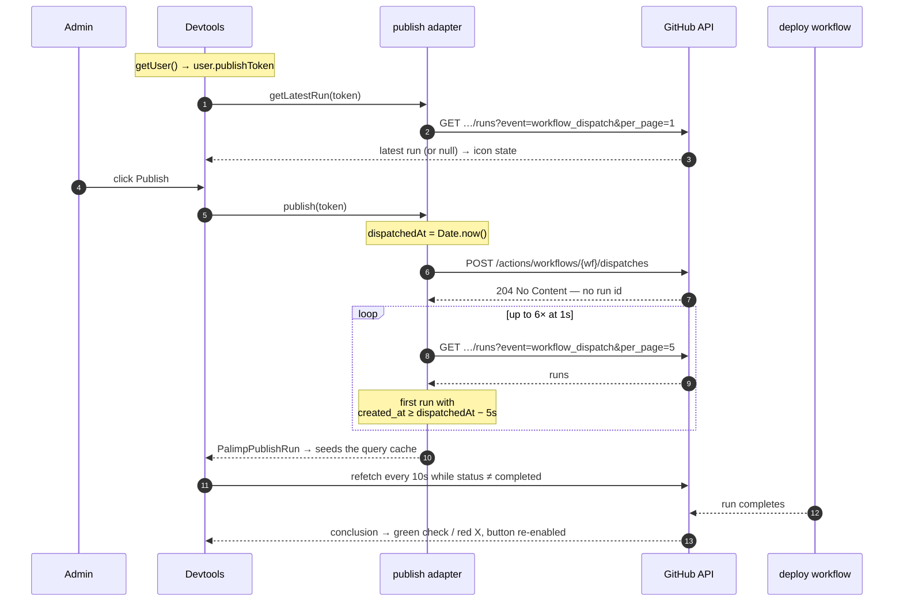
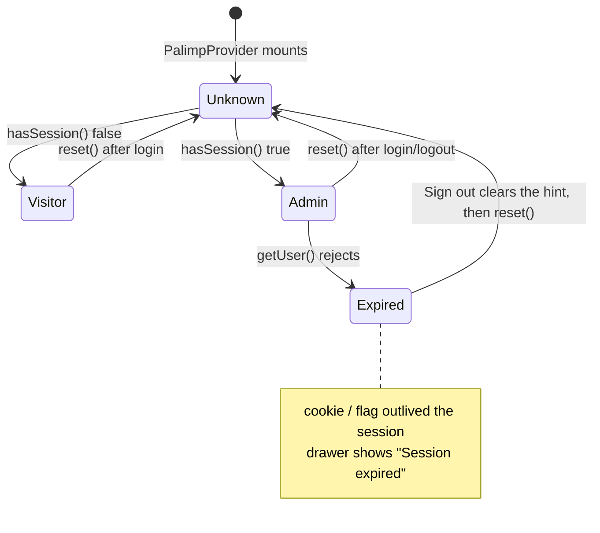

# Palimp architecture

Palimp turns strings in a Next.js page into editable fields for signed-in admins. A visitor gets
plain text; an admin gets an input in the same place, a Devtools drawer to save the batch, and a
Publish button that rebuilds the site.

This document describes what the code does today. For the design discussions that preceded each
feature see [plans/](plans/) — those are historical records, not current API.

## The premise: the site is a static export

Both examples set `output: "export"` ([next.config.ts](../examples/supabase-next/next.config.ts)).
That one line explains most of the design:

- `loadMessages()` runs **at build time**, not per request. Message values are baked into the HTML.
- So a saved edit changes nothing for the public until the site is rebuilt.
- "Publish" therefore means "rebuild the site" — a `workflow_dispatch` on the deploy workflow.
- Admins still see their edits immediately, because the editor re-reads each key client-side.
  The build-time value is only a fallback — which is why it is called `staleValue`.

Nothing in `core` requires static export; a server-rendered host would work and would make
Publish redundant. But the packages are shaped around the assumption that reads are cheap and
bulk on the server, and per-key and live on the client.

## Layers



Dependencies point inward. `core` imports nothing from the adapters; the adapters import only
types and contexts from `core`. The host app is the only place that knows which backend is in
play — it mounts a provider, and everything above it is written against the interface.

## The contracts

Four seams. Three are adapter interfaces the host implements or picks; the fourth is the React
context trio that carries them down the tree.

### `PalimpServerBackendAdapter` — bulk load for the build

[libs/core/src/types.ts](../libs/core/src/types.ts)

```ts
export interface Message {
  key: string;
  value: string;
}

export interface PalimpServerBackendAdapter {
  loadMessages: () => Promise<Message[]>;
}
```

One method, and it loads *everything*. There is no `loadMessage(key)` because the caller is a
server component rendering a whole page: it needs every key it is about to render, and it needs
them before the first `p()` call. A per-key server API would mean one round trip per string.

The consequence is that this interface does not scale to a large message set — the whole table
is read for every page render. That is a deliberate trade for a repo whose message count is in
the dozens. `fe-next` wraps the call in React `cache()`, which caps it at one read per render
however many times `palimp()` is called — `generateMetadata` and the page body share it — but
does nothing about the size of the read.

### `PalimpClientBackendAdapter` — auth, per-key read, batched write

[libs/core/src/PalimpClientBackendAdapter.ts](../libs/core/src/PalimpClientBackendAdapter.ts)

```ts
export interface PalimpClientBackendAdapter {
  login: (value: LoginValue) => Promise<void>;
  logout: () => Promise<void>;
  hasSession: () => boolean;
  getUser: () => Promise<User>;

  getKey: (key: string) => Promise<string | null>;
  // setKey: (key: string, value: string) => Promise<void>;
  setKeys: (entries: ReadonlyArray<readonly [string, string]>) => Promise<void>;
}

type LoginValue = { type: "email-password"; email: string; password: string };
```

Three things about this shape are worth stating:

**Reads are per key here, bulk on the server.** In the browser the caller is a single
`EditComponent` that knows one key and wants a react-query cache entry keyed on it. That gives
per-field loading states and per-field invalidation after a save, for free.

**Writes are batched, and only batched.** `setKey` is commented out at line 10 rather than
deleted. The Save button saves everything the user typed since the last save, so a single-key
write has no caller — and adding one would let a partial failure leave half the drawer's edits
committed. The commented line is a note that the omission is on purpose.

**`hasSession` is synchronous, and that is the awkward one.** It returns `boolean`, not
`Promise<boolean>`, because [`PalimpProvider`](../libs/fe-next/src/PalimpProvider.tsx) needs an
answer on first paint to decide whether to mount the editing UI at all. Neither backend can
actually answer synchronously:

| backend | how it cheats |
| --- | --- |
| Supabase | sniffs `document.cookie` for `sb-<ref>-auth-token`, with `<ref>` regexed out of the project URL |
| Firebase | mirrors a `palimp:firebase:hasSession` flag into `localStorage`, because Firebase Auth persists to IndexedDB, which is async-only |

Both can return `true` for a session the server has already invalidated. See
[Sessions and false positives](#sessions-and-false-positives) for what that costs.

`LoginValue` is a discriminated union with exactly one member. Adding OAuth or magic links is a
change to `core`, not to a backend — the union is the extension point.

### `PalimpPublishAdapter` — dispatch and poll

[libs/core/src/PalimpPublishAdapter.ts](../libs/core/src/PalimpPublishAdapter.ts)

```ts
export interface PalimpPublishAdapter {
  publish: (token: string) => Promise<PalimpPublishRun>;
  getLatestRun: (token: string) => Promise<PalimpPublishRun | null>;
}

export interface PalimpPublishRun {
  id: string;
  dispatchedAt: number;
  url?: string;
  status: PublishRunStatus;
  conclusion?: PublishRunConclusion;
}

export type PublishRunStatus = "queued" | "in_progress" | "completed";

export type PublishRunConclusion =
  | "success" | "failure" | "cancelled" | "timed_out" | "skipped" | "unknown";
```

`publish` returns a run rather than `void`, so the UI has something to show the moment the
dispatch resolves. `getLatestRun` exists so that state survives a page reload without Palimp
persisting anything: the CI provider is the store, and the query refetches on mount.

The status and conclusion enums are deliberately generic rather than GitHub's own — a GitLab or
Vercel adapter maps into the same six conclusions without touching any consumer.

Note that `publish` and `getLatestRun` each take the token as an argument instead of closing over
it. The token comes from the signed-in user's profile, not from adapter config, so it isn't known
when the adapter is constructed.

### The context trio

| context | carries | provided by |
| --- | --- | --- |
| `PalimpClientBackendContext` | the client backend adapter | `PalimpSupabaseProvider` / `PalimpFirebaseProvider` |
| `PalimpPublishContext` | the publish adapter | `PalimpGithubPublishProvider` |
| `PalimpGeneralContext` | UI state: `admin`, `preview`, `togglePreview`, `reset` | `PalimpProvider` |

The first two carry adapters and are provided by the backend packages. The third carries no
adapter at all — it is the session/UI state that `core`'s admin components read:

```ts
export interface IPalimpGeneralContext {
  admin: boolean | undefined;   // undefined = not yet determined
  preview: boolean;
  togglePreview: () => void;
  reset: () => void;            // admin → undefined, re-arming the session check
}
```

`admin: boolean | undefined` is a three-state, and all three are used. `undefined` means the
session check hasn't run yet — [`LoginPageCore`](../libs/core/src/Admin/LoginPageCore.tsx) shows
a spinner rather than flashing a login form at someone who is already signed in.

`reset()` is how the tree re-checks the session: it sets `admin` back to `undefined`, which
re-arms the effect in `PalimpProvider` that calls `hasSession()`. Login and logout both call it.

The general and backend contexts are created with `createContext<T>(null!)` — non-nullable type,
null default. Rendering an admin component outside its provider is a crash, not a degraded mode,
which is what you want for a context that is mandatory.

`PalimpPublishContext` is the exception: `createContext<PalimpPublishAdapter | null>(null)`.
Publishing is optional, so `null` is a state the Devtools has to handle rather than a default that
never survives to a read. Consumers check it — `usePublishButton` reports `available: !!adapter`
and `usePublishRun` passes `skipToken` — and the drawer disables the button with
"No publish provider", the same way a missing token disables it.

## Render, edit, save



Points worth knowing:

- **`staleValue` is a fallback chain, not a value.** `p(key)` resolves it as
  `loaded ?? options.defaultMessage ?? key` — a key with no row in the database and no
  `defaultMessage` renders as its own key, which makes missing content obvious rather than blank.
  In the editor it is the last link of a second chain, `pending ?? data ?? staleValue ?? ""`.
- **`p(key, { asString: true })` returns the same resolved string instead of an element**, for
  `metadata`, `alt`, `aria-label` and anything else typed `string`. It is the identical chain, just
  without the wrapper — which is also its limitation: no element means no editor, and no
  client-side re-read, so an `asString` value is fixed until the next build. See
  [fe-next's README](../libs/fe-next/README.md#quirks).
- **No admin *code* ships to visitors.** `EditComponent`, `Devtools` and `PalimpFields` are all
  behind `next/dynamic` imports of `@palimp/core/admin`, so antd, react-query, and lucide stay out
  of the visitor bundle. This is why `core` has a separate `./admin` export. Admin-only *data* is
  a different question: every `p()` ships its `messageKey` and `staleValue` in the RSC flight
  payload, and `<PalimpFields>` ships its declarations there too. The `admin` check runs in the
  browser, after the server has rendered, so there is no earlier point to make it.
- **`editsStore` is a plain module singleton**, not context —
  [libs/core/src/Admin/editsStore.ts](../libs/core/src/Admin/editsStore.ts). A `Map` plus a
  `Set` of listeners plus a cached array snapshot, read through `useSyncExternalStore`. The
  cached snapshot exists because `useSyncExternalStore` requires a referentially stable
  `getSnapshot` result; rebuilding `Array.from(map.entries())` on every call would loop forever.
  The server snapshot is `undefined` / a shared empty array, so SSR is safe.
- **`fieldsStore` mirrors it for keys that are not on the page.** Same shape, keyed by
  registration id so two `<PalimpFields>` declaring one group can each withdraw their own fields
  ([libs/core/src/Admin/fieldsStore.ts](../libs/core/src/Admin/fieldsStore.ts)). The Devtools
  **Fields** modal renders the ordinary `EditComponent` per registered field, which is why the
  save path needed no changes at all: a modal edit and an inline edit are the same `editsStore`
  entry, the same badge count, and the same `setKeys` batch. It is a placement feature, not a
  second editor.
- **A failed save keeps the edits.** `setKeys` throwing skips `editsStore.clear()`, so the
  drawer still holds everything the user typed.
- **Preview mode short-circuits the input**, rendering `value` as text — including unsaved
  edits. It shows how the page will look, not how it currently is.

## Publish



The token is the user's own GitHub PAT, stored on their profile row and handed to the adapter per
call. It reaches the browser — see [Security posture](#security-posture).

Two GitHub API facts the adapter absorbs so `core` never sees them:

1. **`POST /dispatches` returns 204 with no body.** There is no run id to follow. So the adapter
   timestamps the moment before the POST and then polls the runs list for the first run created
   at or after that instant, with 5 s of clock-skew tolerance. Six attempts, one second apart.
2. **Run identity is by recency, not id.** `getLatestRun` just reads the newest
   `workflow_dispatch` run of that workflow. No id is stored anywhere, which is exactly why
   reload works with no client-side persistence.

Both queries filter on `event=workflow_dispatch`, which keeps push- and PR-triggered runs of the
same workflow out of the drawer — necessary here, since the deploy workflow is also the publish
target. The trade is that a push-triggered deploy republishes the site without the drawer ever
showing it.

Matching by dispatch time is a heuristic. Two publishes inside the tolerance window and the
drawer follows the wrong one — it will still be a dispatch of the right workflow, so the failure
is cosmetic.

## Sessions and false positives



Because `hasSession()` reads a cookie or a `localStorage` flag rather than validating anything,
both backends can report `true` for a session the server has already dropped. What happens then:

- On a content page, `PalimpProvider` mounts the Devtools, whose provider calls `getUser()`. That
  rejects, and the drawer renders
  [`DevtoolsSessionError`](../libs/core/src/Admin/Devtools/DevtoolsSessionError.tsx) — the reason,
  the underlying error message, and a **Sign out** button.
- On `/login`, `LoginPageCore` still sees `admin === true`, redirects to `/`, and shows "Already
  logged in". Unchanged, but no longer a dead end: the drawer on `/` is where the way out now is.

**`logout()` is the recovery.** It is the only method on `PalimpClientBackendAdapter` that clears
the hint `hasSession()` reads, and both backends clear it even against a session the server has
already dropped — so no new adapter method was needed. `reset()` then re-arms the check, which now
returns false, and the page falls back to the visitor view. `core` cannot send the client onward to
the login page because it does not know the route; `fe-next` supplies that through `LoginPage`'s
`onLogin`. So the button signs out and says where to go rather than going there.

Both adapters also correct the hint rather than only reporting it. Firebase clears its flag
whenever `getUser()` finds no current user; Supabase calls `signOut()` on the same path, which is
what removes its auth cookie — the cookie is chunked, so deleting it by hand is not reliable.
Supabase skips the correction on `AuthRetryableFetchError`: a failed fetch is not evidence the
session is gone, and an offline reload should not sign the admin out.

## Why the design is adapter-shaped

The claim: **adding a backend touches zero files in `core`.**

`@palimp/be-firebase` is the proof. Its design plan closes with a "Files modified" section that
reads, in full, "None. The core capability seam already fits"
([plans/be-firebase.md](plans/be-firebase.md)) — and the commit that landed it,
`c9a0e16 add @palimp/be-firebase`, kept that promise. A second auth provider, a second database,
a different session-detection strategy, and a different server SDK all landed as new files under
`libs/be-firebase/` plus a new example.

That is the repo's main architectural bet, and it is worth stating plainly because it is what the
extra indirection buys. `core` could have imported Supabase directly and been perhaps 200 lines
shorter.

The bet has been re-tested twice more, with an honest result each time:

- **Publish was added as a new seam, not a new method.** `publish()` could have been bolted onto
  `PalimpClientBackendAdapter`. It wasn't, because publishing is orthogonal to storage — the
  GitHub adapter is reused unchanged by both backends. That is the seam paying off.
- **Publish status did require changing `core`.** `PalimpPublishAdapter` grew `getLatestRun`, and
  new types and components came with it. The interface absorbed the two GitHub quirks, but the
  capability itself was genuinely new, so the contract moved. Adapters isolate *implementations*,
  not *features*.

The cost is visible in the wiring. A host app mounts four nested providers in a fixed order —
backend, publish, `PalimpProvider`, page — plus a module-level `setBackendAdapter()` call for the
server side, because a server component can't reach React context. See
[examples/supabase-next/app/layout.tsx](../examples/supabase-next/app/layout.tsx) and
[app/palimp.ts](../examples/supabase-next/app/palimp.ts), which is where the registration lives:
a page's `generateMetadata` is not guaranteed to run after the layout module, so the module that
hands out `palimp` is the one that registers the adapter.

## Security posture

Worth being explicit, because two of these look alarming and only one is:

- **The GitHub PAT reaches the browser.** It is read from the user's profile row and passed
  straight to `fetch`. Anyone who can open devtools as that admin can read it. This was a
  deliberate choice to avoid a server route (the examples have no server at runtime — they are
  static). Mitigation is scope: use a fine-grained token limited to `actions: write` on the one
  repo, and rotate it. Per-user tokens at least mean revocation is per user.
- **Firebase web config and the Supabase project URL are in the workflow files.** Both are public
  by design — a Firebase `apiKey` is an identifier, not a credential, and the Supabase URL is in
  every client request. The actual secrets (`SUPABASE_SECRET_KEY`, `PUBLISHABLE_KEY`,
  `FIREBASE_SERVICE_ACCOUNT`) come from GitHub secrets.
- **Server adapters bypass authorization on purpose.** Supabase's secret key skips RLS; Firebase's
  service account skips security rules. They run at build time, not in response to user input, so
  there is no request to authorize.
- **Client writes are only as safe as your rules.** `setKeys` runs in the browser under the user's
  own credentials. RLS policies (Supabase) or security rules (Firebase) are the only thing
  standing between a signed-in user and every message row. Both backend READMEs carry a starting
  policy set.

## Sharp edges

Documented, not fixed. Each is a real behaviour of the code as it stands.

| | |
| --- | --- |
| **No tests** | The root `test` script is `echo "Error: no test specified" && exit 1`. `check-types` is the only automated gate. |
| **`XcoreClientComponent`** | A previous project identity, still in the render path — and `fe-next` also exports `palimp as xcore`. Both are in the public surface, so renaming them is a breaking change. |
| **The publish target is the deploy workflow** | CI sets `NEXT_PUBLIC_GITHUB_WORKFLOW: deploy-supabase.yml` from inside `deploy-supabase.yml`, and that workflow also fires on `push` and `pull_request`. Sound in intent — the deploy *is* the publish — but the drawer only tracks `workflow_dispatch` runs, so a deploy triggered by a push republishes the site without ever appearing there. |
| **Shared query client** | `core`'s `queryClient` is a module singleton, and `logout()` calls `invalidateQueries()` with no key — invalidating every query in it, Palimp's or not. |
| **Dead input branch** | `p()` always passes `textarea`, so `EditComponent`'s `<input>` branch is unreachable through `fe-next`. |

## Where things live

| path | what |
| --- | --- |
| [libs/core/src/](../libs/core/src/) | contracts, contexts, and the admin UI behind `./admin` |
| [libs/fe-next/src/](../libs/fe-next/src/) | `palimp()`, `setBackendAdapter()`, `PalimpProvider`, `LoginPage` |
| [libs/be-supabase/src/](../libs/be-supabase/src/) | Supabase Auth + PostgREST |
| [libs/be-firebase/src/](../libs/be-firebase/src/) | Firebase Auth + Firestore |
| [libs/publish-github/src/](../libs/publish-github/src/) | `workflow_dispatch` + run polling |
| [examples/](../examples/) | one wiring per backend, both static-exported by CI |
